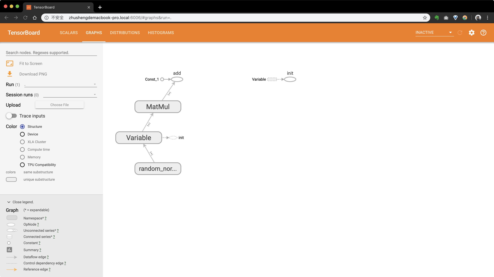

# tensorflow安装

## 创建隔离环境

创建隔离环境，取名为`tensorflow`

```bash
mkvirtualenv -p python3.6 tensorflow
```

## 类型选择

必须选择以下类型的TensorFlow之一来安装：

- TensorFlow仅支持CPU支持。如果您的系统没有NVIDIA®GPU，则必须安装此版本。请注意，此版本的TensorFlow通常会更容易安装（通常在5或10分钟内），因此即使您有NVIDIA GPU，我们建议先安装此版本。
- TensorFlow支持GPU。TensorFlow程序通常在GPU上比在CPU上运行得更快。因此，如果您的系统具有满足以下所示先决条件的NVIDIA®GPU，并且您需要运行性能关键型应用程序，则应最终安装此版本。

## 安装

### Ubuntu和Linux

如果要安装GPU版本的，需要安装一大堆NVIDIA软件(不推荐)：

- CUDA®Toolkit 8.0。有关详细信息，请参阅 NVIDIA的文档。确保您将相关的Cuda路径名附加到 LD_LIBRARY_PATH环境变量中，如NVIDIA文档中所述。 与CUDA Toolkit 8.0相关的NVIDIA驱动程序。
- cuDNN v5.1。有关详细信息，请参阅 NVIDIA的文档。确保CUDA_HOME按照NVIDIA文档中的描述创建环境变量。
- 具有CUDA Compute Capability 3.0或更高版本的GPU卡。有关支持的GPU卡的列表，请参阅 NVIDIA文档。
- libcupti-dev库，即NVIDIA CUDA Profile Tools界面。此库提供高级分析支持。要安装此库，请发出以下命令：

使用pip安装,分别有2.7和3.6版本的

```python
# 仅使用 CPU 的版本
$  pip install https://storage.googleapis.com/tensorflow/linux/cpu/tensorflow-1.0.1-cp27-none-linux_x86_64.whl

$  pip3 install https://storage.googleapis.com/tensorflow/linux/cpu/tensorflow-1.0.1-cp36-cp36m-linux_x86_64.whl
```

### Mac

#### 安装方式1

macX下也可以安装2.7和3.4、3.5的CPU版本

```python
# 2.7
$ pip install https://storage.googleapis.com/tensorflow/mac/cpu/tensorflow-1.0.1-py2-none-any.whl

# 3.4、3.5
$ pip3 install https://storage.googleapis.com/tensorflow/mac/cpu/tensorflow-1.0.1-py3-none-any.whl
```

#### 安装方式2

```bash
# 安装最新版本
pip install --upgrade tensorflow

# 安装指定版本
pip install tensorflow==1.12.0
```

#### 验证安装效果

```bash
python -c "import tensorflow as tf; tf.enable_eager_execution(); print(tf.reduce_sum(tf.random_normal([1000, 1000])))"
```

#### 补充：安装tensorboard

tensorboard是tensorflow提供的可视化界面，建议和tensorflow安装一样的版本。

```bash
# 安装指定版本
pip install tensorboard==1.12.0
```


# tensorflow入门

TensorFlow由谷歌人工智能团队谷歌大脑（Google Brain）开发和维护的一个深度学习框架。

## 入门案例

以下是一个加法运算的示例，我们通过tensorflow构建一个tensorflow graph，然后通过session会话执行该graph，我们通过API sess.run()来指定图的输出。除了最终的结果，参与整个图运算的数据我们都可以输出，如果我们需要用到的话。

```python
import tensorflow as tf
import os
os.environ['TF_CPP_MIN_LOG_LEVEL']='2'

"""
实现一个加法运算，必须遵循以下的格式
"""

# 创建tensor
a = tf.constant(5.0)    
b = tf.constant(6.0)

# 创建op
sum = tf.add(a, b) 

# 通过Session执行graph
with tf.Session() as sess:
    # run是图的输出
    print(sess.run(sum))
    print(sess.run([a, sum]))
    print(sum.eval())
```

我们通过sess.run(sum)来输出数据sum，如果输出的数据是多个，我们需要使用元组。
我们也可以通过sum.eval()来输出数据sum，运行结果如下：

```bash
11.0
[5.0, 11.0]
11.0
```

## 核心概念

tensorflow = tensor + flow，也就是有向数据流，我们使用tensorflow就是构建一个数据流图，然后执行该图。

tensorflow数据流图：

- 张量：tensor，数据就是张量
- 节点：operation(op),所有的运算操作都是一个op
- 图：graph，整个程序的结构就是一个graph，定义了整个程序的框架
- 会话：session，用来运行图

说明：

- tensorflow是一个计算密集型的框架，主要是cpu计算；
- django/scrapy等框架是IO密集型框架，主要是磁盘操作；

### tensor(张量)

tensorflow graph中的数据都是张量,示例如下：

```python
import tensorflow as tf
import os
os.environ['TF_CPP_MIN_LOG_LEVEL']='2'

a = tf.constant(5.0)
b = tf.constant(6.0)
sum = tf.add(a, b)
print(a)
print(sum)
```

输出结果如下：

```bash
Tensor("Const:0", shape=(), dtype=float32)
Tensor("Add:0", shape=(), dtype=float32)
```

我们看到结果都是Tensor对象。

### op(操作)

只要使用tensorflow的API定义的函数都是op，如constant()、add()，tensorflow的op非常丰富。

### graph(图)

tensorflow有一个默认图，如果我们不指定图的话，默认就是在默认图上运行的。

- 默认图

如果我们不指定图的话，我们使用的是Tensorflow的默认图，它会自动调用`graph = tf.get_default_graph()`，相当于给程序分配一段内存，我们所有的Tensor、op都是在这张图上。

```python
import tensorflow as tf
import os
os.environ['TF_CPP_MIN_LOG_LEVEL']='2'

# 新建2个tensor
a = tf.constant(1.0)
b = tf.constant(2.0)
# 新建1个op
sum = tf.add(a,b)

print(a.graph)
print(b.graph)
print(sum.graph)

# 默认图
graph = tf.get_default_graph()
print(graph)

with tf.Session() as sess:
    # 查看会话所在图
    print(sess.graph)  
```

运行结果如下：

```bash
<tensorflow.python.framework.ops.Graph object at 0x1114caf98>
<tensorflow.python.framework.ops.Graph object at 0x1114caf98>
<tensorflow.python.framework.ops.Graph object at 0x1114caf98>
<tensorflow.python.framework.ops.Graph object at 0x1114caf98>
<tensorflow.python.framework.ops.Graph object at 0x1114caf98>
```

通过运行结果，我们发现tensor、op和session都在一个图上，也就是系统的默认图。`with tf.Session() as sess:`相当于`with tf.Session(graph=g) as sess:`。

- 自定义图

默认使用的是tensorflow默认图，我们也是可以自定义图。示例：

```python
import tensorflow as tf
import os
os.environ['TF_CPP_MIN_LOG_LEVEL']='2'

# 创建图
g = tf.Graph()

# 使用自定义的图
with g.as_default():
    pass
```

### session(会话)

session是一个会话，tensorflow的graph都必须在Session中执行。

- 会话的作用

1. 运行图的结构
2. 分配资源计算，决定graph在什么设备上运行
3. 掌握资源（变量的资源、队列、线程）

会话对象，我们可以执行创建、运行和关闭等操作。

```python
s = tf.Session()
s.run()
s.close()
```

### 上下文环境

会话就是graph的上下文环境，只要有Session就有上下文环境。


# tensorboard入门

tensorboard是tensorflow框架为我们提供的可视化web界面，我们可以在web界面中看到我们的tensorflow graph，并查看图的结构、图的运行结果、监视的一些过程数据、一些参数的优化过程等等。

我们编写一个入门案例进行说明。

第一步：编写代码

```python
import tensorflow as tf
import os
os.environ['TF_CPP_MIN_LOG_LEVEL']='2'

x =  tf.Variable(tf.random_normal([1,1], mean=0.0, stddev=1.0))
w = tf.constant(5.0)
b = tf.constant(2.0)

y = tf.matmul(x, [[w]]) + b

init_op = tf.global_variables_initializer()

with tf.Session() as sess:
    sess.run(init_op)
    # 将图结构写入事件文件（evnets file）中,我们需要指定目录
    filewritter = tf.summary.FileWriter('./logs/', sess.graph)
    print(sess.run(y))
```

当我们执行完上面的指令后，会在”logs/”目录下生成一个事件文件(events file)，这个目录需要我们先创建好。

每执行一次程序都会生成一个events file，这个events file中就包含了我们的图数据。tensorborad默认会加载最新的，覆盖之前的events file。

第二步：在terminal中启动tensorboard,指令如下：

```bash
tensorboard --logdir='./logs/'
```

我们可以通过`http://zhushengdemacbook-pro.local:6006`去打开tensorboard可视化界面，我们访问`127.0.0.1:6006`也可以。

如果我们有多个events file日志会输出，”Overwriting the metagraph with the newest event.”也就是说当我们的”logs/”目录下有多个events文件时，tensorboard会覆盖之前的事件文件。

第三步：打开tensorboard可视化界面，访问`127.0.0.1:6006`,如下图所示：



总结：在tensorboard可视化中，events file是核心，我们evnets file生成成功了，自然就可以使用tensorboard进行可视化了。如果我们需要对图的运行过程数据进行查看，也是可以的，这需要我们在代码中进行设置，更多请参考其它文章。

