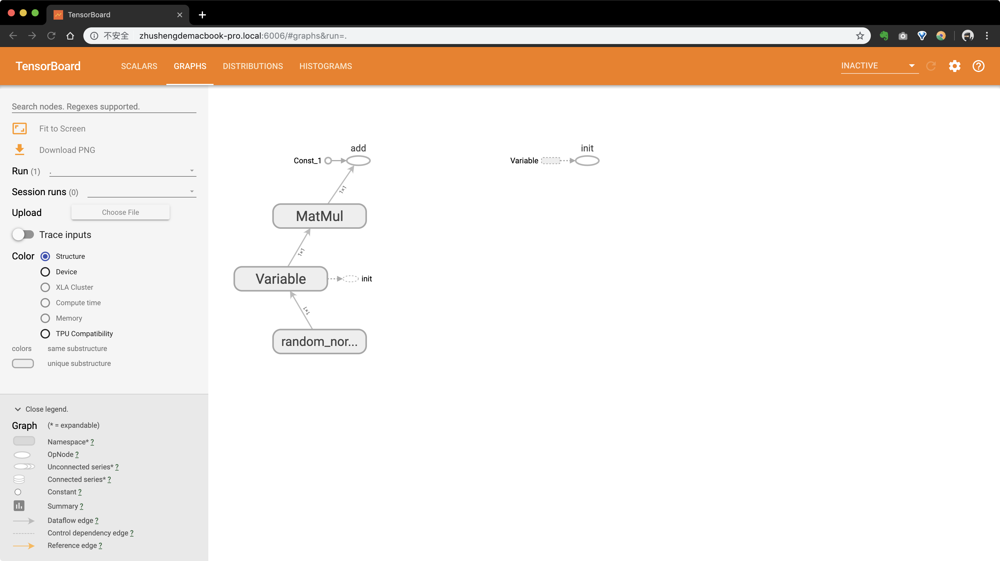

# tensorboard入门

tensorboard是tensorflow框架为我们提供的可视化web界面，我们可以在web界面中看到我们的tensorflow graph，并查看图的结构、图的运行结果、监视的一些过程数据、一些参数的优化过程等等。

我们编写一个入门案例进行说明。

第一步：编写代码

```python
import tensorflow as tf
import os
os.environ['TF_CPP_MIN_LOG_LEVEL']='2'

x =  tf.Variable(tf.random_normal([1,1], mean=0.0, stddev=1.0))
w = tf.constant(5.0)
b = tf.constant(2.0)

y = tf.matmul(x, [[w]]) + b

init_op = tf.global_variables_initializer()

with tf.Session() as sess:
    sess.run(init_op)
    # 将图结构写入事件文件（evnets file）中,我们需要指定目录
    filewritter = tf.summary.FileWriter('./logs/', sess.graph)
    print(sess.run(y))
```

当我们执行完上面的指令后，会在”logs/”目录下生成一个事件文件(events file)，这个目录需要我们先创建好。

每执行一次程序都会生成一个events file，这个events file中就包含了我们的图数据。tensorborad默认会加载最新的，覆盖之前的events file。

第二步：在terminal中启动tensorboard,指令如下：

```bash
tensorboard --logdir='./logs/'
```

我们可以通过`http://zhushengdemacbook-pro.local:6006`去打开tensorboard可视化界面，我们访问`127.0.0.1:6006`也可以。

如果我们有多个events file日志会输出，”Overwriting the metagraph with the newest event.”也就是说当我们的”logs/”目录下有多个events文件时，tensorboard会覆盖之前的事件文件。

第三步：打开tensorboard可视化界面，访问`127.0.0.1:6006`,如下图所示：



总结：在tensorboard可视化中，events file是核心，我们evnets file生成成功了，自然就可以使用tensorboard进行可视化了。如果我们需要对图的运行过程数据进行查看，也是可以的，这需要我们在代码中进行设置，更多请参考其它文章。


