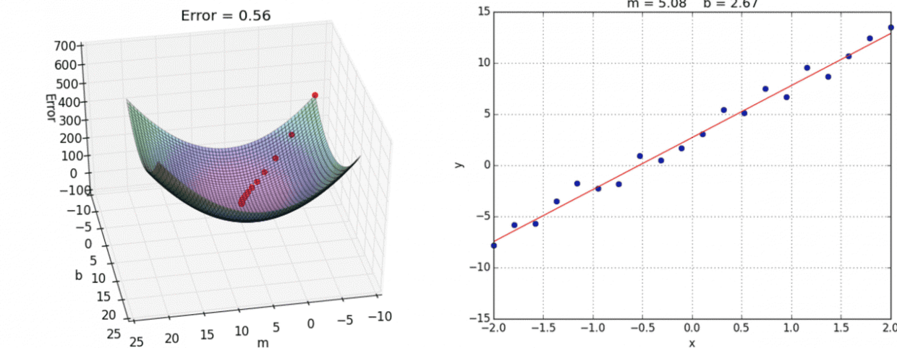
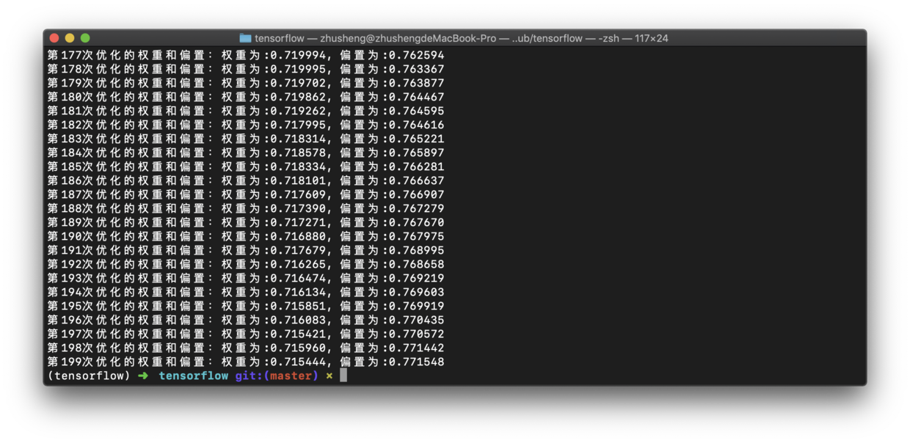
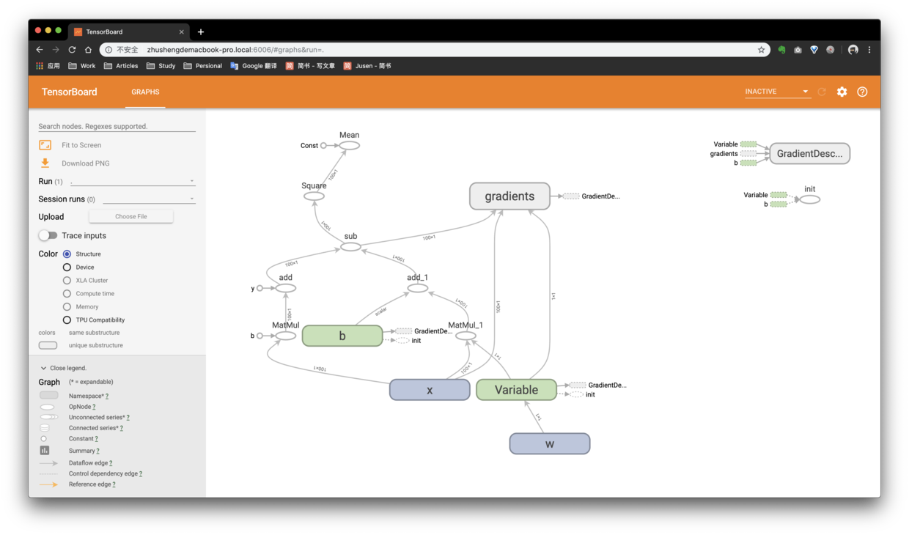
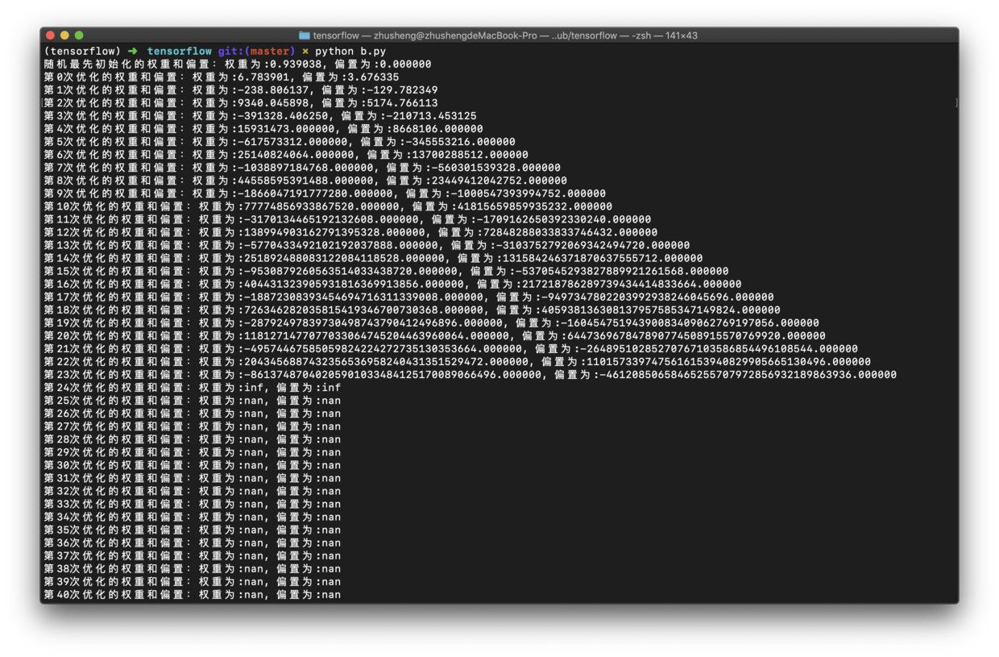
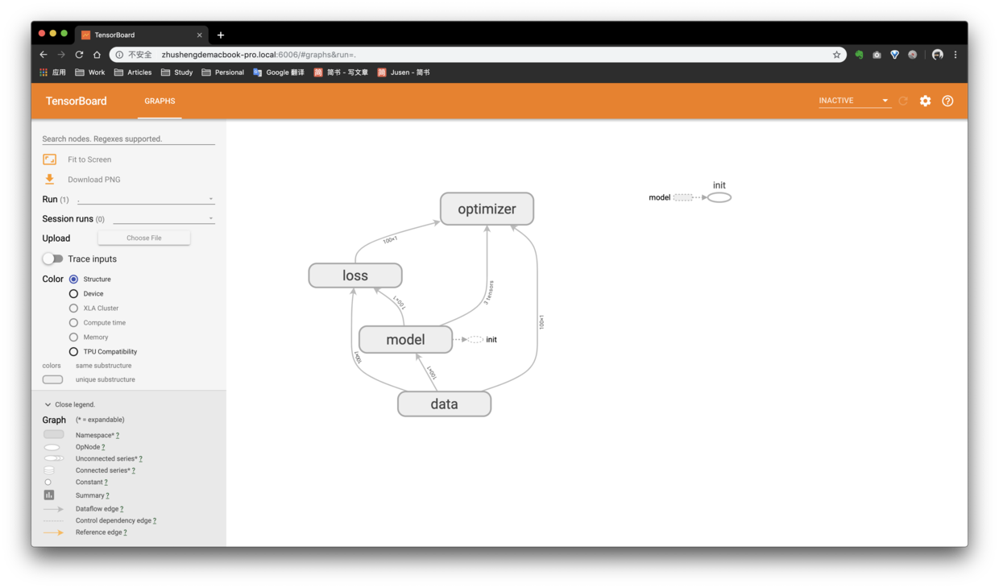
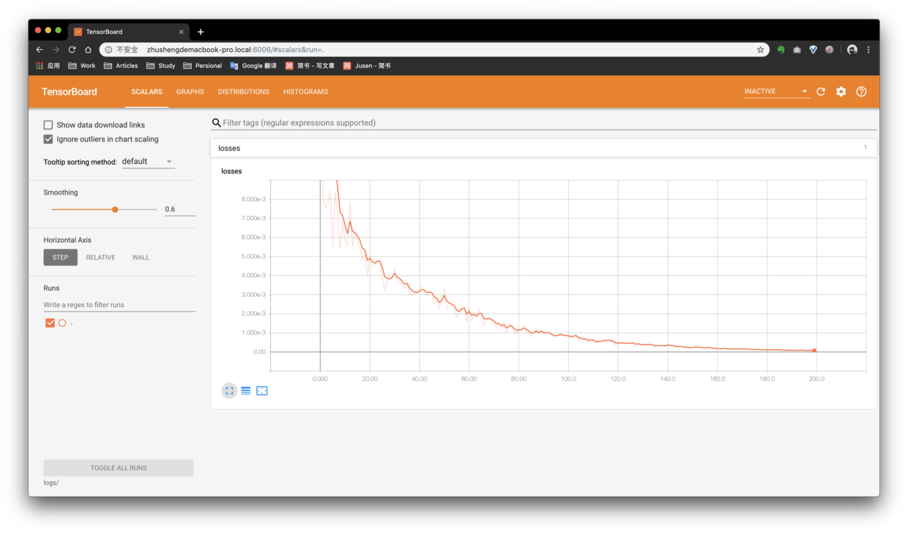
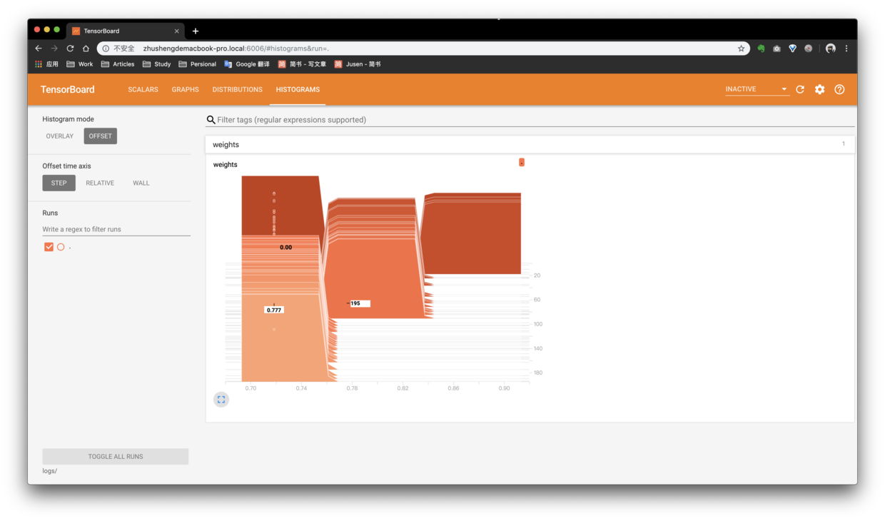
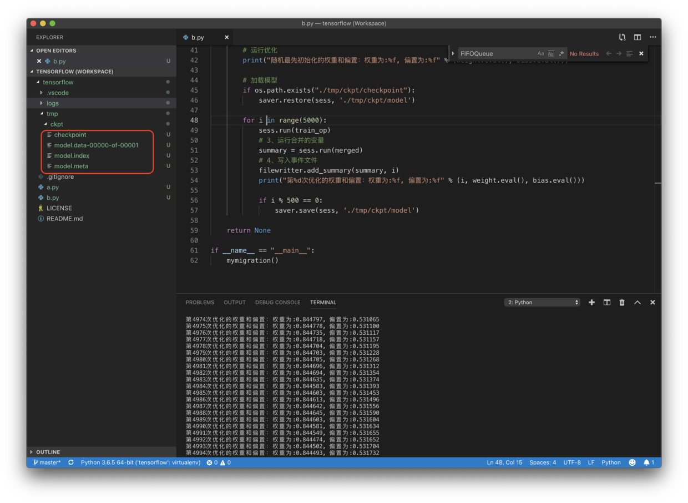
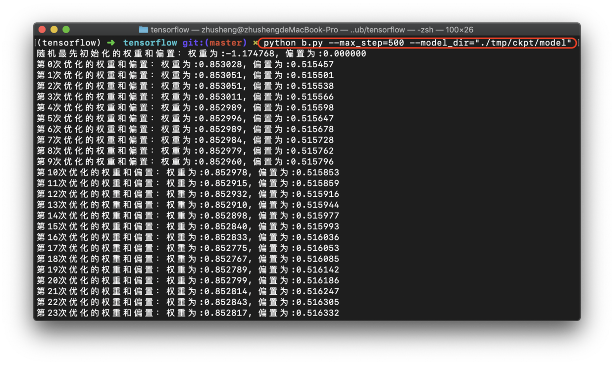

# tensorflow线性回归

我们通过一个案例讲述如何使用tensorflow来做线性回归。

## 什么是线性回归

线性回归的公式：

1个特征：`y = w*x + b`， x是输入，y是输出，w是权重，b是偏置。

n个特征：`y = w1*x1 +  w2*x2 + ... + wn*xn + b`，有n个权重，1个偏置

  线性回归的核心：

- 算法：线性回归。
- 策略：均方误差。
- 优化：梯度下降，需要设置学习率。

## 线性回归的使用步骤

1. 准备好特征值和目标值，也就是数据。特征值是输入，目标值是输出。以预测房价为例，位置、面积、朝向等都是特征值，房总价是目标值。
2. 建立模型。需要1个权重、1个偏置，然后进行随机初始化，得到一个预测函数`y_predict`。
3. 求损失函数`loss`，也就是误差，我们以均方误差的方式来求损失。
4. 优化损失，在线性回归中，我们通过梯度下降的方式来优化损失，求损失函数最小值。形象化的说法：就是给定一个随机点，我们从山上找到山底的一个过程，如下图所示。




说明：什么是均方误差？

就是对预测值和目标值求差并开根号，然后求平均值，公式如下：

`[(y1-y1') ^2+ (y2-y2') ^2+ ... + (yn-yn') ^2] / n`

## 核心API

梯度下降优化API：`tf.train.GradientDescentOptimizer(learning_rate)`
	
参数说明：
learning_rate:学习率，一般为0.1、0.01、0.001等量级的，当然也可以是1、10、100但是基本不会这么写。

函数的返回值是一个梯度下降op，我们可以在会话中进行运行。

## 核心代码

```python
import tensorflow as tf
import os
os.environ['TF_CPP_MIN_LOG_LEVEL']='2'

def mymigration():
    """
    自实现一个线性回归预测
    """
    # 1、准备数据，这里我们通过一个公式来模拟数据，如果是真实案例，我们可以读取外部数据。
    x = tf.random_normal([100,1], mean=1.75, stddev=0.5, name="x")
    # 矩阵相乘必须是二维的
    y_true = tf.matmul(x, [[0.7]]) + 0.8

    # 2、建立线性回归模型,1个权重、1个偏置， y = w * x + b
    # 随机给一个权重和偏置，让它去计算损失，也就相当于梯度下降的起点
    # 在这里，我们的weight和bias是需要去优化的，它是变化的，必须使用tf.Variable去定义
    # 在训练过程中，我们可以通过设置trainable=False来限制某个变量不跟随梯度下降进行优化，默认是True
    weight = tf.Variable(tf.random_normal([1,1], mean=0.0, stddev=1.0, name="w"))
    bias = tf.Variable(0.0, name="b")
    y_predict = tf.matmul(x, weight) + bias

    # 3、建立损失函数，均方误差，tf.square求方差，reduce_mean()求平均值
    loss = tf.reduce_mean(tf.square(y_true- y_predict))

    # 4、梯度下降优化损失，learning_rate=0~1, 2, 3, ...
    train_op = tf.train.GradientDescentOptimizer(0.1).minimize(loss)

    # 通过会话运行程序
    # 定义一个初始化变量的op
    init_op = tf.global_variables_initializer()
    with tf.Session() as sess:
        # 初始化变量
        sess.run(init_op)
        # 运行优化200次，也就是run op 200次
        print("随机最先初始化的权重和偏置：权重为:%f, 偏置为:%f" % (weight.eval(), bias.eval()))
        for i in range(200):
            sess.run(train_op)
            print("第%d次优化的权重和偏置：权重为:%f, 偏置为:%f" % (i, weight.eval(), bias.eval()))

    return None

if __name__ == "__main__":
    mymigration()
```

运行效果如下图所示：



因为没有数据，我们通过公式`y_true = tf.matmul(x, [[0.7]]) + 0.8`来随机样本数据。实际中，我们可以通过读取外部数据，训练并构建模型。

通过200次的训练，我们最后得到的权重为0.715，偏置为0.77，训练的模型还是比较贴合样本数据的，我们可以直接和我们模拟数据的公式进行比较。如果我们是导入外部数据的话，我们是不知道训练的模型好坏的，我们需要去不断的优化提高模型预测的正确率。

## tensorboard可视化

我们在代码里加一行建立事件文件的代码，加入的位置如下所示：

```python
 # 初始化变量
sess.run(init_op)

 # 建立事件文件
 filewritter = tf.summary.FileWriter('logs/', graph=sess.graph)
```
重新执行整个代码，然后在终端执行`tensorboard --logdir="logs/"`启动tensorboard，我们在浏览器查看图解钩如下所示：



我们通过流程图可以看出整个计算过程，变量`w`与`x`进行matnul矩阵乘法操作，输出结果与`b`进行add操作，然后与样本`x`通过公式获得的目标值进行sub操作求差值，然后通过square求开平方，然后通过mean求平均值。

在后面，我们讲变量作用域API`tf.variable_scope()`来改变这个图。

## 学习率

Learning_rate在梯度下降中是一个非常重要的参数，它决定的是从山顶到达山底的step和速度。一般都是很小的，0.1、0.01、0.001等都有。

Learning_rate过大或者过小都不好，过大会导致梯度爆炸，过小会达不到想要的训练效果，需要增加训练次数。

如果我们的Learning_rate过大，就会导致问题。当我把Learning_rate调整为5时，运行结果如下：



最后的结果都是nan，这种现象叫做梯度爆炸。

梯度爆炸
>在极端的情况下，权重的值变得非常大，以致于益处，导致NAN值就是梯度爆炸。梯度爆炸问题在深度学习神经网络RNN中更容易出现。
>
>>如何解决梯度爆炸问题：（1）重新设计网络；（2）调整学习率；（3）使用梯度截断，在训练过程中检查和限制梯度的大小；（4）使用激活函数。

## 拓展

### 变量作用域

我们可以通过`tf.variable_scope(<scope_name>)`创建指定名字的变量作用域，增加作用域让模型代码更加清晰，作用分明。修改后的完整代码如下所示：

```python
import tensorflow as tf
import os
os.environ['TF_CPP_MIN_LOG_LEVEL']='2'

def mymigration():
    
    with tf.variable_scope("data"):
        x = tf.random_normal([100,1], mean=1.75, stddev=0.5, name="x")
        y_true = tf.matmul(x, [[0.7]]) + 0.8

    with tf.variable_scope("model"):
        weight = tf.Variable(tf.random_normal([1,1], mean=0.0, stddev=1.0, name="w"))
        bias = tf.Variable(0.0, name="b")
        y_predict = tf.matmul(x, weight) + bias

    with tf.variable_scope("loss"):
        loss = tf.reduce_mean(tf.square(y_true- y_predict))

    with tf.variable_scope("optimizer"):
        train_op = tf.train.GradientDescentOptimizer(0.1).minimize(loss)

    # 通过会话运行程序
    # 定义一个初始化变量的op
    init_op = tf.global_variables_initializer()
    with tf.Session() as sess:
        # 初始化变量
        sess.run(init_op)

        # 建立事件文件
        filewritter = tf.summary.FileWriter('logs/', graph=sess.graph)
     
        # 运行优化
        print("随机最先初始化的权重和偏置：权重为:%f, 偏置为:%f" % (weight.eval(), bias.eval()))
        for i in range(200):
            sess.run(train_op)
            print("第%d次优化的权重和偏置：权重为:%f, 偏置为:%f" % (i, weight.eval(), bias.eval()))
    return None

if __name__ == "__main__":
    mymigration()
```

需要注意的是，这个作用域和函数的作用域不一样。

我们通过tensorboard就可以很清晰的了解作用域的效果，我们刷新一下tensorboard，如下所示：



### 增加变量显示

增加变量显示的目的是：观察模型的参数、损失值等变量值的变化。

1、收集变量
tf.summary.scalar(name=’’,tensor) ：收集对于损失函数和准确率等单值变量,name为变量的名字，tensor为值。
tf.summary.histogram(name=‘’,tensor) ：收集高维度的变量参数。
tf.summary.image(name=‘’,tensor) ：收集输入的图片张量能显示图片。

2、合并变量并写入事件文件
merged = tf.summary.merge_all()：合并变量。
summary = sess.run(merged)：运行合并，每次迭代都需运行。
FileWriter.add_summary(summary,i)：写入事件文件，i表示第几次的值。

完整示例代码如下所示：

```python
import tensorflow as tf
import os
os.environ['TF_CPP_MIN_LOG_LEVEL']='2'

def mymigration():
    
    with tf.variable_scope("data"):
        x = tf.random_normal([100,1], mean=1.75, stddev=0.5, name="x")
        y_true = tf.matmul(x, [[0.7]]) + 0.8

    with tf.variable_scope("model"):
        weight = tf.Variable(tf.random_normal([1,1], mean=0.0, stddev=1.0, name="w"))
        bias = tf.Variable(0.0, name="b")
        y_predict = tf.matmul(x, weight) + bias

    with tf.variable_scope("loss"):
        loss = tf.reduce_mean(tf.square(y_true- y_predict))

    with tf.variable_scope("optimizer"):
        train_op = tf.train.GradientDescentOptimizer(0.1).minimize(loss)

    # 1、收集tensor
    tf.summary.scalar("losses", loss)
    tf.summary.histogram("weights", weight)
    # 2、合并变量，写入事件文件
    merged = tf.summary.merge_all()
    
    # 通过会话运行程序
    # 定义一个初始化变量的op
    init_op = tf.global_variables_initializer()
    with tf.Session() as sess:
        # 初始化变量
        sess.run(init_op)
        # 建立事件文件
        filewritter = tf.summary.FileWriter('logs/', graph=sess.graph)
        # 运行优化
        print("随机最先初始化的权重和偏置：权重为:%f, 偏置为:%f" % (weight.eval(), bias.eval()))
        for i in range(200):
            sess.run(train_op)
            # 3、运行合并的变量
            summary = sess.run(merged)
            # 4、写入事件文件
            filewritter.add_summary(summary, i)
            print("第%d次优化的权重和偏置：权重为:%f, 偏置为:%f" % (i, weight.eval(), bias.eval()))
    return None

if __name__ == "__main__":
    mymigration()
```
说明：当我们的代码发生改变了，只要logdir没有变化，我们不需要重新重新执行启动tensorboard的指令

我们刷新以下浏览器，查看tensorboard，我们刚才通过scalar收集了loss，通过histogram收集了weight，这个是可以在tensorboard中进行可视化查看的，如下图所示：





这个图不容易看懂，它使用的是高斯算法，这里不讲。

### 模型的保存和加载

为什么需要模型的保存和加载？

在训练过程中，我们的训练耗时非常长，比如说需要训练1万次，训练需要5天。如果当我们训练到了第2天的时候，服务器宕机了，那等服务器开机后又需要重新开始训练，2天的训练白干了。

有了模型的保存和加载，我们可以指定每隔1000次保存依次模型，总共保存最新的5隔模型，那么当服务器宕机了，重启后，我们可以加载之间的模型训练结果，接着开始训练。

使用逻辑：
首先，创建模型保存对象；
然后在训练之前，检查指定的目录下是否存在模型文件，如果存在就加载模型文件；
最后，在训练过程中，指定策略去保存模型。

核心API：

`tf.train.Saver(var_list=None,max_to_keep=5)`：创建模型保存对象。
参数说明：
- var_list:指定将要保存和还原的变量。它可以作为一个dict或一个列表传递.
- max_to_keep：指示要保留的最近检查点文件的最大数量。创建新文件时，会删除较旧的文件。如果无或0，则保留所有检查点文件。默认为5（即保留最新的5个检查点文件。）


`saver.save(sess, '/tmp/ckpt/model')`：模型保存，我们需要指定模型的名称，这里我们取名为model。说明：模型保存文件格式：checkpoint文件，在我们保存模型成功后，在其目录下会有一个checkpoint文件。

`saver.restore(sess, '/tmp/ckpt/model')`：模型加载。在训练之前，我们可以检查以下我们是有存在checkpoint文件，如果有checkpoint文件，我们可以加载模型，接着之前训练的结果进行训练。

完整代码如下：

```python
import tensorflow as tf
import os
os.environ['TF_CPP_MIN_LOG_LEVEL']='2'

def mymigration():
    
    with tf.variable_scope("data"):
        x = tf.random_normal([100,1], mean=1.75, stddev=0.5, name="x")
        y_true = tf.matmul(x, [[0.7]]) + 0.8

    with tf.variable_scope("model"):
        weight = tf.Variable(tf.random_normal([1,1], mean=0.0, stddev=1.0, name="w"))
        bias = tf.Variable(0.0, name="b")
        y_predict = tf.matmul(x, weight) + bias

    with tf.variable_scope("loss"):
        loss = tf.reduce_mean(tf.square(y_true- y_predict))

    with tf.variable_scope("optimizer"):
        train_op = tf.train.GradientDescentOptimizer(0.001).minimize(loss)

    # 1、收集tensor
    tf.summary.scalar("losses", loss)
    tf.summary.histogram("weights", weight)
    # 2、合并变量，写入事件文件
    merged = tf.summary.merge_all()
    
    # 定义一个模型的保存对象
    saver = tf.train.Saver(var_list=None,max_to_keep=5)

    # 通过会话运行程序
    # 定义一个初始化变量的op
    init_op = tf.global_variables_initializer()
    with tf.Session() as sess:
        # 初始化变量
        sess.run(init_op)

        # 建立事件文件
        filewritter = tf.summary.FileWriter('logs/', graph=sess.graph)

        # 运行优化
        print("随机最先初始化的权重和偏置：权重为:%f, 偏置为:%f" % (weight.eval(), bias.eval()))

        # 加载模型
        if os.path.exists("./tmp/ckpt/checkpoint"):
        	saver.restore(sess, './tmp/ckpt/model')

        for i in range(5000):
            sess.run(train_op)
            # 3、运行合并的变量
            summary = sess.run(merged)
            # 4、写入事件文件
            filewritter.add_summary(summary, i)
            print("第%d次优化的权重和偏置：权重为:%f, 偏置为:%f" % (i, weight.eval(), bias.eval()))

            if i % 500 == 0:
                saver.save(sess, './tmp/ckpt/model')
                
    return None

if __name__ == "__main__":
    mymigration()
```

运行结束后，我们查看`./tmp/ckpt/model`文件(model为文件名)，如下图所示：



在会话之前，我们需要定义一个模型保存对象，用于保存和加载模型。我们在运行会话时，在训练过程中保存模型，在训练前加载模型。

### 自定义命令行参数

我们可以在程序中使用自定义命令行参数，我们可以在运行程序的时候动态去指定我们的一些参数。

完整代码如下所示：

```python
import tensorflow as tf
import os
os.environ['TF_CPP_MIN_LOG_LEVEL']='2'

# 参数说明：自定义的参数名称、默认值、说明
tf.app.flags.DEFINE_integer("max_step", 100, "模型训练的步数")
tf.app.flags.DEFINE_string("model_dir", " ", "模型文件加载路径")

# 取一个短名称
FLAGS = tf.app.flags.FLAGS

def mymigration():
    
    with tf.variable_scope("data"):
        x = tf.random_normal([100,1], mean=1.75, stddev=0.5, name="x")
        y_true = tf.matmul(x, [[0.7]]) + 0.8

    with tf.variable_scope("model"):
        weight = tf.Variable(tf.random_normal([1,1], mean=0.0, stddev=1.0, name="w"))
        bias = tf.Variable(0.0, name="b")
        y_predict = tf.matmul(x, weight) + bias

    with tf.variable_scope("loss"):
        loss = tf.reduce_mean(tf.square(y_true- y_predict))

    with tf.variable_scope("optimizer"):
        train_op = tf.train.GradientDescentOptimizer(0.001).minimize(loss)

    # 1、收集tensor
    tf.summary.scalar("losses", loss)
    tf.summary.histogram("weights", weight)
    # 2、合并变量，写入事件文件
    merged = tf.summary.merge_all()
    
    # 定义一个模型的保存对象
    saver = tf.train.Saver(var_list=None,max_to_keep=5)

    # 通过会话运行程序
    # 定义一个初始化变量的op
    init_op = tf.global_variables_initializer()
    with tf.Session() as sess:
        # 初始化变量
        sess.run(init_op)

        # 建立事件文件
        filewritter = tf.summary.FileWriter('logs/', graph=sess.graph)

        # 运行优化
        print("随机最先初始化的权重和偏置：权重为:%f, 偏置为:%f" % (weight.eval(), bias.eval()))

        # 加载模型
        if os.path.exists("./tmp/ckpt/checkpoint"):
            saver.restore(sess, FLAGS.model_dir)

        for i in range(FLAGS.max_step):
            sess.run(train_op)
            # 3、运行合并的变量
            summary = sess.run(merged)
            # 4、写入事件文件
            filewritter.add_summary(summary, i)
            print("第%d次优化的权重和偏置：权重为:%f, 偏置为:%f" % (i, weight.eval(), bias.eval()))
        
        saver.save(sess, FLAGS.model_dir)   
    return None

if __name__ == "__main__":
    mymigration()
```

然后我们在当前目录下执行如下指令：
`python b.py --max_step=500 --model_dir="./tmp/ckpt/model"`

效果图如下所示：




