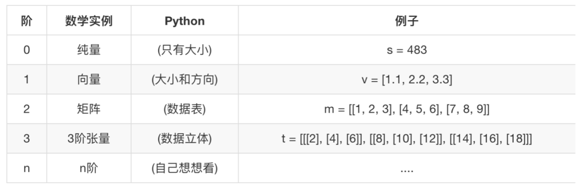
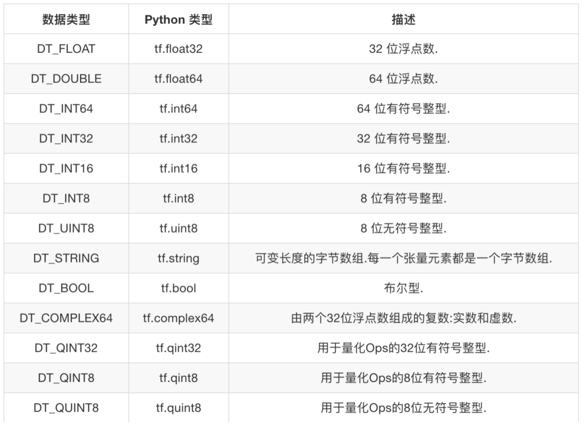

# tensor

## tensor简介

Tensor是一个类，包含了属性和常用函数，一个Tensor对象主要包含以下三个部分，如下所示：

`Tensor("Placeholder:0", shape=(2, 3), dtype=float32)`

- 第一部分是Tensor Name，比如：’Constant’、‘Placeholder’、‘Variable’等，0没有什么实质性的含义，只是表示Tensor的顺序，当前是0，那么下一个Tensor就是1了；
- 第二部分是Tensor Shape,Tensor的形状，这里是[2,3]，2行3列。
- 第三部分是Tensor Type，也就是tensor张量的数据类型。

### Tensor的形状

张量的形状，在Tensorflow中我们用阶乘表示：



在Tensorflow中，[n,m]向量，表示n行m列，行表示特征数量，列表示样本数量。

### Tensor的数据类型

tensor的数据类型有很多，如下图所示：



我们会发现有float32、float64，同理的还有int32、int64。float64表示浮点精度，但是实际并不会多分配内存，两者的使用效果差不多，我们常用float32。

### Tensor的属性

tensor对象有以下属性，我们可以通过tensor对象进行获取。

- graph：张量所在的图
- op:张量的op
- name:张量的名称
- shape:张量的形状

示例

```python
import tensorflow as tf
import os
os.environ['TF_CPP_MIN_LOG_LEVEL']='2'

a = tf.constant(1.0)

with tf.Session() as sess:
    print("graph-->", a.graph)
    print("op-->",a.op)
    print("name-->",a.name)
    print("shape-->",a.shape)
```

输出结果如下所示：

```bash
graph--> <tensorflow.python.framework.ops.Graph object at 0x111a48fd0>
op--> name: "Const"
op: "Const"
attr {
  key: "dtype"
  value {
    type: DT_FLOAT
  }
}
attr {
  key: "value"
  value {
    tensor {
      dtype: DT_FLOAT
      tensor_shape {
      }
      float_val: 1.0
    }
  }
}

name--> Const:0
shape--> ()
```

### Placeholder占位符张量

我们可以通过`tf.placeholder()`来创建一个占位符张量，用于在运行图的时候，可以动态赋予数据。在Session中运行图的时候，我们通过`run(fetches, feed_dict=None, graph=None)`来动态赋予数据。

参数说明：
- fetches:tensor
- feed_dict:喂养的动态数据。
- graph:图，默认就是当前的graph，所以不用填写。

```python
import tensorflow as tf
import os
os.environ['TF_CPP_MIN_LOG_LEVEL']='2'

plt = tf.placeholder(tf.float32, [2,3])
print(plt)

with tf.Session() as sess:
    sess.run(plt, feed_dict={
        plt: [
            [1, 2, 3],
            [3, 4, 5]
        ]
    })
```

输出结果如下所示：

```bash
Tensor("Placeholder:0", shape=(2, 3), dtype=float32)
```

我们可以看到，我们的plt是一个tensor。

## 张量的操作

### 张量的动态形状和静态形状

Tensorflow中，张量具有静态形状和动态形状。

- 静态形状

创建一个张量，初始状态的形状，如果初始状态的shape有不确定项，我们可以通过`tf.Tensor.set_shape()`去更新形状，一旦shape是确定的，不允许我们去更改，这个张量的shape在整个图的运行中都是固定不可更改的。

我们可以通过`tf.Tensor.get_shape()`去获取静态的形状。

核心API：
获取静态形状：`tf.Tensor.get_shape()`
更新静态形状：`tf.Tensor.set_shape()`

- 动态形状

一种描述原始张量在执行过程中的一种形状，这个张量的形状在图的执行过程中是可以动态改变的。

核心API：
更新动态形状：`tf.reshape()`

示例如下：

```python
import tensorflow as tf
import os
os.environ['TF_CPP_MIN_LOG_LEVEL']='2'

plt = tf.placeholder(tf.float32, [None,2])
print(plt)
# 列已经确定了，不能修改，行是None不确定可以修改
plt.set_shape([3,2])
print(plt)
print(plt.get_shape())

# reshape重新创建一个张量
plt2 = tf.reshape(plt, [2,3])
print(plt2)

with tf.Session() as sess:
    pass
```

输出如下所示：

```bash
Tensor("Placeholder:0", shape=(?, 2), dtype=float32)
Tensor("Placeholder:0", shape=(3, 2), dtype=float32)
(3, 2)
Tensor("Reshape:0", shape=(2, 3), dtype=float32)
```

说明：reshape前后的张量数据个数肯定是不能变的，比如[2,3]->[3,2]是可以的，[2,3]->[3,3]肯定是不行的。

### 创建随机张量

如果张量里的数据我们不确定的话，我们可以使用tensorflow提供的API创建随机张量。

以下是从正态分布创建随机张量的例子

```python
tf.random_normal(shape, mean=0.0, stddev=1.0, dtype=tf.float32,seed=None, name=None)
```

说明：我们主要关注2个参数，mean表示数据平均值，也就是数学中的μ，stddev表示标准差，也就是数学中的σ。当μ=0，σ=1时，也就是标准正态分布。

### 张量类型转换

例如，如果我们的张量的dtype是tf.int32类型的，我们可以将其转换为tf.float32类型的。

核心API：`tf.cast()`

示例如下：
```python
a = tf.constant(1.0)
b = tf.cast(a, tf.int32)
```
在上面的例子中，我们将tf.float32转换为tf.int32类型。

### 张量的合并

我们可以将2个张量的数据进行合并，核心API是`tf.concat()`，示例如下：

```python
import tensorflow as tf
import os
os.environ['TF_CPP_MIN_LOG_LEVEL']='2'

b = [[1,2,3],[4,5,6]]
c = [[7,8,9],[10,11,12]]
# 张量合并
d = tf.concat([b,c], axis=0)

with tf.Session() as sess:
    print(d.eval())
    pass
```

结果输入如下图所示：

```bash
[[ 1  2  3]
 [ 4  5  6]
 [ 7  8  9]
 [10 11 12]]
```

说明：axis=0表示按行合并，axis=1表示按列合并。


