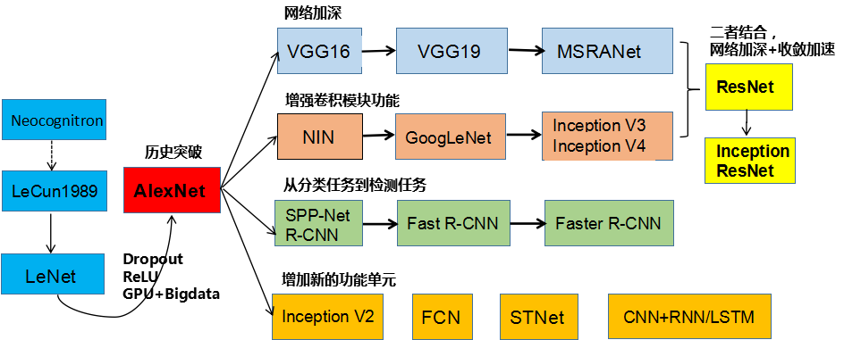
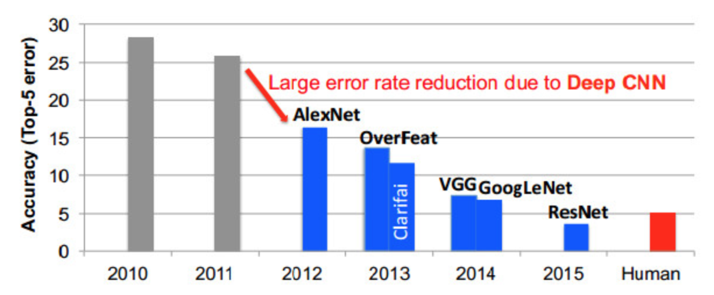

# 神经网络

## 感知机

## 神经网络

### tensorflow神经网络演示

http://playground.tensorflow.org/#activation=sigmoid&regularization=L2&batchSize=10&dataset=circle&regDataset=reg-plane&learningRate=0.03&regularizationRate=0&noise=0&networkShape=3&seed=0.93351&showTestData=false&discretize=false&percTrainData=50&x=true&y=true&xTimesY=false&xSquared=false&ySquared=false&cosX=false&sinX=false&cosY=false&sinY=false&collectStats=false&problem=classification&initZero=false&hideText=false&showTestData_hide=false&learningRate_hide=false&regularizationRate_hide=false&percTrainData_hide=false&numHiddenLayers_hide=false&discretize_hide=false&activation_hide=false&problem_hide=false&noise_hide=false&regularization_hide=false&dataset_hide=false&batchSize_hide=false&playButton_hide=false

### 神经网络的发展

定义：在机器学习和认知科学领域，人工神经网络（artificial neural network，
缩写ANN），简称神经网络（：neural network，缩写NN）或类神经网络，是一
种模仿生物神经网络的结构和功能的计算模型，用于对函数进行估计或近似。


Geoffrey Everest Hinton

杰弗里·埃弗里斯特·辛顿 （英语：Geoffrey Everest Hinton）（1947年12月6日－）是一位英国出生的计算机学家和心理学家，以其在神经网络方面的贡献闻名。辛顿是反向传播算法的发明人之一，也是深度学习的积极推动者。

### 神经网络的种类

基础神经网络：单层感知器，线性神经网络，BP神经网络，Hopfield神经网络等
进阶神经网络：玻尔兹曼机，受限玻尔兹曼机，递归神经网络等
深度神经网络：深度置信网络，卷积神经网络，循环神经网络，LSTM网络等

### 神经网络的组成

`结构（Architecture）`：例如，神经网络中的变量可以是神经元连接的权重。
`激励函数（Activity Rule）`：大部分神经网络模型具有一个短时间尺度的动力学规则，来定义神经元如何根据其他神经元的活动来改变自己的激励值。
`学习规则（Learning Rule）`：学习规则指定了网络中的权重如何随着时间推进而调整。（反向传播算法）

### 神经网络的特点


- 输入向量的维度和输入神经元的个数相同。
- 每个连接都有一个权值。
- 同一层神经元之间没有连接。
- 由输入层、隐层、输出层组成。
- 第N层与第N-1层的所有神经元连接，也叫全连接。

# 浅层人工神经网络

略

## Mnist数据集案例

该数据集主要是用于识别手写的数字图片。

### 数据集分析

Mnist数据集可以从官网下载，数据集氛围55000行的训练数据集和10000行的测试数据集。每一个数据单元包含一个数字图片和一个对应的标签。我们可以把图片定义为xs，标签定义为ys。

数字图片都是黑白图片，包含28像素x28像素，共784个特征，如下所示，我们用向量进行表示就是[55000, 784]


Mnist中的每个图像都有相应的标签，0～9之间的数字表示图像手写的数字，我们使用one-hot编码进行处理，如下所示。我们用向量进行表示就是[55000, 10]


### One-hot API

```python
tf.one_hot(indices, depth, on_value=None, off_value=None, axis=None, dtype=NOne, name=None)
```

参数说明：

- indices：数据集标签。
- depth：张量的深度，即类别数。

### SoftMax回归


### 交叉墒损失

交叉墒损失数学公式如下：


参数说明：

- y<sub>i</sub><sup>'</sup>为神经网络结果，也就是y_predict；y<sub>i</sub>为真实结果，也就是y_true。

交叉墒损失 Tensorflow API如下：

```python
# 计算logits和labels之间的交叉损失熵
tf.nn.softmax_cross_entropy_with_logits(labels=None, logits=None,name=None)
```

参数说明：

- labels:标签值（真实值）
- logits：样本加权之后的值
- return:返回损失值列表

重要说明：API返回的结果是每一个真实值和预测值之间的交叉墒损失列表，最后我们需要进行求平均值，获得交叉墒损失。`tf.reduce_mean(input_tensor)`

### 梯度下降

我们还是使用梯度下降的策略来优化损失，求损失的最小值，API如下：

```python
tf.train.GradientDescentOptimizer(learning_rate).minimize(loss)
```

参数说明：

- learning_rate:学习率
- minimize(loss):最小化损失

### 准确率acc

我们可以比较预测结果和真实结果的准确性。

```python
equal_list = tf.equal(tf.argmax(y, 1), tf.argmax(y_label, 1))
accuracy = tf.reduce_mean(tf.cast(equal_list, tf.float32))
```

说明：tf.argmax()这里是按行求最大值，1表示按行。

手写的图片预测的是属于0～9，一共10个类别的概率，那个概率最大，我们就认为它属于那个类别，然后将结果转换为one-hot编码。然后与真实结果的one-hot编码进行对比，所以equal_list是一个True、False的列表。

### 源代码

```python
import tensorflow as tf
from tensorflow.examples.tutorials.mnist import input_data

FLAGS = tf.app.flags.FLAGS
tf.app.flags.DEFINE_string("data_dir", "/Users/zhusheng/WorkSpace/Tmp/dataset/Mnist", "mnist数据集")
# 默认是进行训练
tf.app.flags.DEFINE_integer("is_train", 1, "指定程序是预测还是训练")
"""
全连接层，有多少个特征就有多少个输出
"""

def full_connected():
    # 获取真实的数据
    mnist = input_data.read_data_sets(FLAGS.data_dir, one_hot=True)

    # 1、建立数据的占位符 x [None, 784]    y_true [None, 10]
    with tf.variable_scope("data"):
        x = tf.placeholder(tf.float32, [None, 784])
        y_true = tf.placeholder(tf.int32, [None, 10])

    # 2、建立一个全连接层的神经网络 w [784, 10]   b [10]
    with tf.variable_scope("fc_model"):
        # 随机初始化权重和偏置
        weight = tf.Variable(tf.random_normal([784, 10], mean=0.0, stddev=1.0), name="w")
        bias = tf.Variable(tf.constant(0.0, shape=[10]))
        # 预测None个样本的输出结果matrix [None, 784]* [784, 10] + [10] = [None, 10]
        y_predict = tf.matmul(x, weight) + bias

    # 3、求出所有样本的损失，然后求平均值
    with tf.variable_scope("soft_cross"):
        # 计算交叉熵损失，并求平均值
        loss = tf.reduce_mean(tf.nn.softmax_cross_entropy_with_logits(labels=y_true, logits=y_predict))

    # 4、梯度下降求出损失
    with tf.variable_scope("optimizer"):
      	# 使用梯度下降优化损失，求损失的最小值
        train_op = tf.train.GradientDescentOptimizer(0.1).minimize(loss)

    # 5、计算准确率
    with tf.variable_scope("acc"):
        # 真实值与预测值的对比，返回的是true or false
        equal_list = tf.equal(tf.argmax(y_true, 1), tf.argmax(y_predict, 1))
        print("equal_list:", equal_list)
        # equal_list  None个样本   [1, 0, 1, 0, 1, 1,..........]
        accuracy = tf.reduce_mean(tf.cast(equal_list, tf.float32))
        print("accuracy:", accuracy)

    # 收集变量 单个数字值收集
    tf.summary.scalar("losses", loss)
    tf.summary.scalar("acc", accuracy)
    # 高纬度变量收集
    tf.summary.histogram("weightes", weight)
    tf.summary.histogram("biases", bias)

    # 定义一个初始化变量的op
    init_op = tf.global_variables_initializer()

    # 定义一个合并变量de op
    merged = tf.summary.merge_all()

    # 创建一个saver，用于进行模型保存和加载
    saver = tf.train.Saver()

    # 开启会话去训练
    with tf.Session() as sess:
        # 初始化变量
        sess.run(init_op)

        # 建立events文件，然后写入
        filewriter = tf.summary.FileWriter("./tmp/summary/test/", graph=sess.graph)

        # 训练
        if FLAGS.is_train == 1:
            # 迭代步数去训练，更新参数预测
            for i in range(2000):
                # 取出真实存在的特征值和目标值
                mnist_x, mnist_y = mnist.train.next_batch(50)

                # 运行train_op训练
                sess.run(train_op, feed_dict={x: mnist_x, y_true: mnist_y})

                # 写入每步训练的值
                summary = sess.run(merged, feed_dict={x: mnist_x, y_true: mnist_y})
                filewriter.add_summary(summary, i)

                print("训练第%d步,准确率为:%f" % (i, sess.run(accuracy, feed_dict={x: mnist_x, y_true: mnist_y})))

            # 训练完成后，保存模型。如果训练步数比较多，可以在训练过程中保存模型，默认报错最新的5个。
            saver.save(sess, "./tmp/ckpt/fc_model")

        # 预测
        else:
            # 加载模型
            saver.restore(sess, "./tmp/ckpt/fc_model")
						
            # 预测100次
            for i in range(100):
              
                # 每次取一张图片进行预测
                x_test, y_test = mnist.test.next_batch(1)
								
                # 这里直接运行y_predict op即可进行预测，因为到这里，我们的权重和偏置是优化后的
                print("第%d张图片，手写数字图片目标是:%d, 预测结果是:%d" % (
                    i,
                    tf.argmax(y_test, 1).eval(),
                    tf.argmax(sess.run(y_predict, feed_dict={x: x_test, y_true: y_test}), 1).eval()
                ))
    return None


if __name__ == '__main__':
    full_connected()
```

#### 模型训练

首先执行训练，默认`FLAGS.is_train == 1`也就是进行训练

```bash
python mnist.py
```

输出结果如下：

```
训练第0步,准确率为:0.040000
训练第1步,准确率为:0.140000
训练第2步,准确率为:0.160000
训练第3步,准确率为:0.160000
...
训练第1997步,准确率为:0.920000
训练第1998步,准确率为:0.880000
训练第1999步,准确率为:0.860000
```

训练过程中，我们添加了收集变量的代码，以及保存和加载模型的代码。

我们可以在tensorboard中查看变量的变化趋势

```bash
tensorboard --logdir="tmp/summary/test"
```

查看网址：http://127.0.0.1:6006/

#### 模型预测

在代码中，我们已经编写了对100张图片进行预测的代码，我们如下执行上面的代码

```bash
python mnist.py --is_train="0"
```

输出结果如下：

```bash
第0张图片，手写数字图片目标是:5, 预测结果是:5
第1张图片，手写数字图片目标是:4, 预测结果是:4
第2张图片，手写数字图片目标是:3, 预测结果是:3
第3张图片，手写数字图片目标是:9, 预测结果是:9
...
第95张图片，手写数字图片目标是:3, 预测结果是:3
第96张图片，手写数字图片目标是:6, 预测结果是:6
第97张图片，手写数字图片目标是:7, 预测结果是:7
第98张图片，手写数字图片目标是:5, 预测结果是:9
第99张图片，手写数字图片目标是:2, 预测结果是:2
```

通过预测结果，我们看到大部分结果预测都是正确的，只有少数预测的结果存在一些问题。


# 深层神经网络

深度神经网络，也就是深度学习神经网络，它与单一隐藏层的神经网络的区别在于深度，有更多的隐藏层。

在深度神经网络中，每一个节点层在前一层输出的基础上学习识别一组特定的特征，随着神经网络的深度的增加， 节点所能识别的特征也就越来越复杂。


# 卷积神经网络

## 全连接神经网络的缺点

主要体现在以下几个方面：

- 参数太多，在cifar-10的数据集中，只有32*32*3，就会有这么多权重，如果说更大的图片，比如200*200*3就需
  要120000多个，这完全是浪费。

- 没有利用像素之间位置信息，对于图像识别任务来说，每个像素与周围的像素都是联系比较紧密的。

- 层数限制。

## 卷积神经网络简介

### 卷积神经网络的发展历史

卷积神经网络的发展历史如下图所示。卷积神经网络（Convolutional Neural Network，简写CNN）是由Yann LeCun发明的，Yann LeCun是Geoffrey Everest Hinton的学生，于1989年发明卷积神经网络。

后来，出现了`AlexNet`，一个历史性的突破，它内部集成了一系列的卷积、激活和池化，我们可以直接调用该模型进行训练。后来演变产生了VGG16、NIN、R-CNN、Inception V2等分支，其中VGG16和NIN属于Google研发的，后来合并为了`ResNet（残差网络）`，这个网络模型是进行图像识别的非常重要的一个网络模型。




下图是几个神经网络的错误率比较图：



通过对比，我们发现，GoogleNet、ResNet能大幅度减少错误率。

### 常见的卷积模型

#### LeNet

诞生于1986年，模型结构如下所示：


#### AlexNet

诞生于2012年，模型结构如下所示：


该模型有60M以上的参数总量，也就是60*10000个参数，一般的计算机很难运行起来。

#### GoogleNet

GoogleNet的模型结构算是比较好的，模型过程结构如下图所示：


该模型结构中的一些卷积、激活和池化操作如下：


### 卷积神经网络的结构分析

神经网络(neural networks)的基本组成包括输入层、隐藏层、输出层。而卷积神经网络的特点在于隐藏层分为卷积层和池化层(pooling layer，又叫下采样层)。

- 卷积层：通过在原始图像上平移来提取特征，每一个特征就是一个特征映射。
- 池化层：通过特征后稀疏参数来减少学习的参数，降低网络的复杂度（最大池化和平均池化）

如图是一个使用卷积神经网络进行图片对象识别的案例


如下图所示，在整个卷积网络中，我们有卷积（CONV）、激活（RELU）、池化（POOL）等步骤，每一层神经网络都必须包含CONV、RELU和POOL三个部分。最后是一个全连接层（FC）输出类别，这个和目标值的类别个数有关。

如下图是数据在卷积过程中的体量变化，原始数据在卷积过程中数据的体量会变大；然后经过RELU激活函数，激活函数不改变数据的形状；最后我们进行池化操作，将相邻的特征进行特征提取，以代表性的特征来代替这一块区域的特征，减少数据的体量。


如下图所示是一个池化操作的过程分析，池化前的数据体量为[224,224,64]，池化后为[112,112,64]，我们提取相邻的代表性特征。如[[1,1],[5,6]]，6最大是这一块的代表性特征。


### 卷积计算过程分析

在卷积计算过程中，我们会涉及到一些参数，如下图所示，我们可以根据卷积的一些参数来计算一个卷积计算的输出数据体积。核心参数为：

- 过滤器的个数。
- 过滤器的大小，也就是过滤器的形状。如3x3，5x5
- 卷积的步长。
- 零填充，是否零填充。


如下图所示是当图片通道为1，过滤器为1，形状为3x3，步长为1的卷积计算过程。


如下图所示是当图片通道为1，过滤器为1，形状为3x3，步长为2的卷积计算过程。


我们再来看一下三通道图片的卷积计算过程动态图，如下所示：


### 卷积层的零填充

在进行卷积计算过程分析的时候，我们有一个超参数为零填充，它也是影响卷积计算的核心参数。

卷积核在提取特征映射时的动作称之为padding（零填充），由于移动步长不一定能整出整张图的像素宽度。所以需要在图片外围进行零填充，其中有两种方式，SAME和VALID。

- SAME：越过边缘取样，取样的面积和输入图像的像素宽度一致。
- VALID：不越过边缘取样，取样的面积小于输入人的图像的像素宽度

如下图所示，在零填充之前，我们的形状为[32, 32, 3],零填充之后的形状为[36, 36, 3]。


## 激活函数

激活函数有以下几种，我们可以在`tensorflow神经网络演示`页面看到：

- Linear：表示没有激活函数
- sigmoid：使用的最多的激活函数
- Relu：在卷积神经网络中使用最多的激活函数，2018年发明。
- Tanh：在Relu没有出来之前的替代产品，现在基本不使用。

早期，我们的激活函数只有一个，也就是sigmoid函数，公式如下：


在计算卷积神经网络的时候，我们发现使用sigmoid激活函数的计算工作量非常大，从公式我们也可以看出，我们需要进行大量的指数运算。后来，出现了一个激活函数叫做Tanh，可以大量减少计算工作量。

直到2018年，出现了一个新的激活函数，完全替代了Tanh，它就是Relu，公式如下：


它的取值只有两个，当x <=0时，y=0；当x>0时，y=x，这个计算方式非常简单，大幅度提高了计算效率，图像如下所示：


## 卷积网络API介绍

一个卷积网络过程通常包含卷积层、激活层、池化层三个部分，下面分别说明这三个部分的API。

### 卷积层

```python
# 计算给定4-D input和filter张量的2维卷积
tf.nn.conv2d(input, filter, strides=, padding=, name=None)
```

参数说明：

- input：给定的输入张量，具有[batch,heigth,width,channel]，类型为float32,64
- filter：指定过滤器的大小，[filter_height, filter_width, in_channels, out_channels]
- strides：strides = [1, stride, stride, 1],步长
- padding：“SAME”, “VALID”，使用的填充算法的类型。其中”VALID”表示滑动超出部分舍弃，“SAME”表示填充，使得变化后height,width一样大。基本都是使用“SAME”，保证能完整扫描整张图片的所有特征，一个不漏。

### 激活层

现在使用的激活函数主要有2个，sigmoid和relu，但是sigmoid不适合卷积神经网络，我们使用Relu激活函数。

主要有两点原因：

- 第一，采用sigmoid等函数，反向传播求误差梯度时，计算量相对大，而采用Relu激活函数，整个过程的计算量节省很多。
- 第二，对于深层网络，sigmoid函数反向传播时，很容易就会出现梯度消失的情况（求不出权重和偏置）。

tensorflow提供的Relu激活函数API如下

```python
tf.nn.relu(features, name=None)
```

参数说明：

- features:卷积后加上偏置的输出结果，作为激活的输入。

说明：激活函数的输入和输出结果形状是一样的，也就是说激活层不改变数据的形状。

### 池化层

Pooling层主要的作用是特征提取，通过去掉Feature Map中不重要的样本，进一步减少参数数量。Pooling的方法很多，最常用的是Max Pooling。


API如下：

池化函数我们一般选max_pool

```python
# 执行最大池数
tf.nn.max_pool(value, ksize=, strides=, padding=,name=None)
```

参数说明：

- value:4-D Tensor形状[batch, height, width, channels]
- ksize:池化窗口大小，[1, ksize, ksize, 1]
- strides:步长大小，[1,strides,strides,1]
- padding:“SAME”, “VALID”，使用的填充算法的类型，使用“SAME”

一般我们选择ksize=2, strides=2，padding="SAME"，相当于就是进行数据体量维度减半的操作，例如：

池化前的数据：[10000, 32, 32, 1]，池化后[10000, 16, 16, 1]

### 全连接层

前面的卷积和池化相当于做特征工程，后面的全连接相当于做特征加权。

最后的全连接层在整个卷积神经网络中起到“分类器”的作用。

## 源代码

```python
import tensorflow as tf
from tensorflow.examples.tutorials.mnist import input_data

FLAGS = tf.app.flags.FLAGS
tf.app.flags.DEFINE_string("data_dir", "/Users/zhusheng/WorkSpace/Tmp/dataset/Mnist", "mnist数据集")
tf.app.flags.DEFINE_integer("is_train", 1, "指定程序是预测还是训练")

# 定义一个初始化权重的函数
def weight_variables(shape):
    w = tf.Variable(tf.random_normal(shape=shape, mean=0.0, stddev=1.0))
    return w

# 定义一个初始化偏置的函数
def bias_variables(shape):
    b = tf.Variable(tf.constant(0.0, shape=shape))
    return b

def model():
    """
    自定义的卷积模型
    :return:
    """
    # 1、准备数据的占位符 x [None, 784]  y_true [None, 10]
    with tf.variable_scope("data"):
        x = tf.placeholder(tf.float32, [None, 784])
        y_true = tf.placeholder(tf.int32, [None, 10])

    # 2、一卷积层 卷积: 5*5*1，32个，strides=1 激活: tf.nn.relu ，池化
    with tf.variable_scope("conv1"):
        # 随机初始化权重, 偏置[32]
        w_conv1 = weight_variables([5, 5, 1, 32])
        b_conv1 = bias_variables([32])

        # 对x进行形状的改变[None, 784]  [None, 28, 28, 1]，如果形状是None，需要写成-1
        x_reshape = tf.reshape(x, [-1, 28, 28, 1])

        # [None, 28, 28, 1]-----> [None, 28, 28, 32]
        x_relu1 = tf.nn.relu(tf.nn.conv2d(x_reshape, w_conv1, strides=[1, 1, 1, 1], padding="SAME") + b_conv1)

        # 池化 2*2 ,strides2 [None, 28, 28, 32]---->[None, 14, 14, 32]
        x_pool1 = tf.nn.max_pool(x_relu1, ksize=[1, 2, 2, 1], strides=[1, 2, 2, 1], padding="SAME")

    # 3、二卷积层卷积: 5*5*32，64个filter，strides=1 激活: tf.nn.relu 池化：
    with tf.variable_scope("conv2"):
        # 随机初始化权重,  权重：[5, 5, 32, 64]  偏置[64]
        w_conv2 = weight_variables([5, 5, 32, 64])
        b_conv2 = bias_variables([64])

        # 卷积，激活，池化计算
        # [None, 14, 14, 32]-----> [None, 14, 14, 64]
        x_relu2 = tf.nn.relu(tf.nn.conv2d(x_pool1, w_conv2, strides=[1, 1, 1, 1], padding="SAME") + b_conv2)

        # 池化 2*2, strides 2, [None, 14, 14, 64]---->[None, 7, 7, 64]
        x_pool2 = tf.nn.max_pool(x_relu2, ksize=[1, 2, 2, 1], strides=[1, 2, 2, 1], padding="SAME")

    # 4、全连接层 [None, 7, 7, 64]--->[None, 7*7*64]*[7*7*64, 10]+ [10] =[None, 10]
    with tf.variable_scope("conv2"):

        # 随机初始化权重和偏置
        w_fc = weight_variables([7 * 7 * 64, 10])
        b_fc = bias_variables([10])

        # 修改形状 [None, 7, 7, 64] --->None, 7*7*64]
        x_fc_reshape = tf.reshape(x_pool2, [-1, 7 * 7 * 64])

        # 进行矩阵运算得出每个样本的10个结果
        y_predict = tf.matmul(x_fc_reshape, w_fc) + b_fc

        # 收集高维度变量
        tf.summary.histogram("w_fc", w_fc)
        tf.summary.histogram("b_fc", b_fc)

    return x, y_true, y_predict


def conv_fc():
    # 获取真实的数据
    mnist = input_data.read_data_sets(FLAGS.data_dir, one_hot=True)

    # 定义模型，得出输出
    x, y_true, y_predict = model()

    # 进行交叉熵损失计算
    # 3、求出所有样本的损失，然后求平均值
    with tf.variable_scope("soft_cross"):
        # 求平均交叉熵损失
        loss = tf.reduce_mean(tf.nn.softmax_cross_entropy_with_logits(labels=y_true, logits=y_predict))

    # 4、梯度下降求出损失
    with tf.variable_scope("optimizer"):
        train_op = tf.train.GradientDescentOptimizer(0.0001).minimize(loss)

    # 5、计算准确率
    with tf.variable_scope("acc"):
        equal_list = tf.equal(tf.argmax(y_true, 1), tf.argmax(y_predict, 1))

        # equal_list  None个样本   [1, 0, 1, 0, 1, 1,..........]
        accuracy = tf.reduce_mean(tf.cast(equal_list, tf.float32))


    # 收集单个数字值变量
    tf.summary.scalar("loss", loss)
    tf.summary.scalar("accuracy", accuracy)

    # 定义一个合并变量de op
    merged = tf.summary.merge_all()

    # 创建一个saver
    saver = tf.train.Saver()

    # 定义一个初始化变量的op
    init_op = tf.global_variables_initializer()

    # 开启回话运行
    with tf.Session() as sess:
        sess.run(init_op)

        # 建立events文件，然后写入
        filewriter = tf.summary.FileWriter("./tmp/summary/test/", graph=sess.graph)

        # 训练
        if FLAGS.is_train == 1:
            # 循环去训练
            for i in range(1000):

                # 取出真实存在的特征值和目标值
                mnist_x, mnist_y = mnist.train.next_batch(50)

                # 运行train_op训练
                sess.run(train_op, feed_dict={x: mnist_x, y_true: mnist_y})
                print("训练第%d步,准确率为:%f" % (i, sess.run(accuracy, feed_dict={x: mnist_x, y_true: mnist_y})))

                # 写入每步训练的值
                summary = sess.run(merged, feed_dict={x: mnist_x, y_true: mnist_y})
                filewriter.add_summary(summary, i)

            # 保存模型
            saver.save(sess, "./tmp/ckpt/fc_model")

        else:
            # 加载模型
            saver.restore(sess, "./tmp/ckpt/fc_model")

            # 如果是0，做出预测
            for i in range(100):
                # 每次测试一张图片 [0,0,0,0,0,1,0,0,0,0]
                x_test, y_test = mnist.test.next_batch(1)

                print("第%d张图片，手写数字图片目标是:%d, 预测结果是:%d" % (
                    i,
                    tf.argmax(y_test, 1).eval(),
                    tf.argmax(sess.run(y_predict, feed_dict={x: x_test, y_true: y_test}), 1).eval()
                ))
    return None


if __name__ == "__main__":
    conv_fc()
```


### 模型训练

首先执行训练，默认`FLAGS.is_train == 1`也就是进行训练

```bash
python cnn.py
```

输出结果如下：

```
训练第0步,准确率为:0.060000
训练第1步,准确率为:0.020000
训练第2步,准确率为:0.060000
...
训练第997步,准确率为:0.840000
训练第998步,准确率为:0.800000
训练第999步,准确率为:0.880000
```

训练过程中，我们添加了收集变量的代码，以及保存和加载模型的代码。

我们可以在tensorboard中查看变量的变化趋势

```bash
tensorboard --logdir="tmp/summary/test"
```

查看网址：http://127.0.0.1:6006/

### 模型预测

在代码中，我们已经编写了对100张图片进行预测的代码，我们如下执行上面的代码

```bash
python cnn.py --is_train="0"
```

输出结果如下：

```bash
第0张图片，手写数字图片目标是:7, 预测结果是:8
第1张图片，手写数字图片目标是:9, 预测结果是:9
第2张图片，手写数字图片目标是:0, 预测结果是:0
...
第93张图片，手写数字图片目标是:9, 预测结果是:9
第94张图片，手写数字图片目标是:4, 预测结果是:6
第95张图片，手写数字图片目标是:6, 预测结果是:6
第96张图片，手写数字图片目标是:6, 预测结果是:6
第97张图片，手写数字图片目标是:6, 预测结果是:6
第98张图片，手写数字图片目标是:8, 预测结果是:8
第99张图片，手写数字图片目标是:5, 预测结果是:5
```

通过预测结果，我们看到大部分结果预测都是正确的，只有少数预测的结果存在一些问题。

