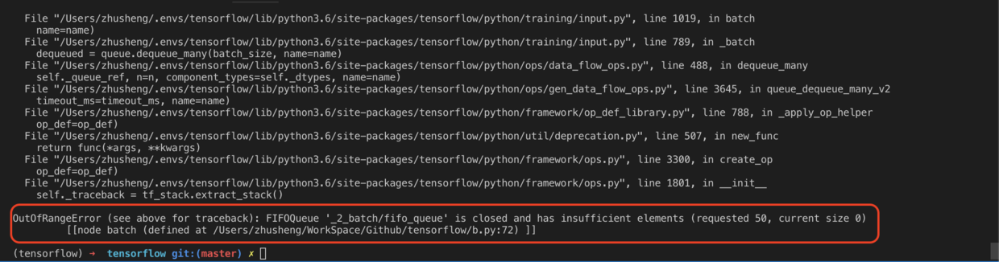

# 异常

## OutOfRangeError

`mages_batch = tf.train.batch([images_resize], batch_size=50, num_threads=2, capacity=50)`

我是在使用`tf.train.batch`批处理读取图片数据的时候出现了这个问题，当我调整读取20个样本时，不报错，当我调整读取样本为30、40、50等等都会报错，错误信息如下：



我尝试了以下方法：
1、查找是否有显示异常的图片，查找是否不是RGB的图片
2、增加如下代码：

```
 with tf.Session() as sess:
        sess.run(tf.local_variables_initializer())
        sess.run(tf.global_variables_initializer())
        ...
```
但是都没有解决我的问题。

但是出现了新的问题，当我调整为30的时候，有时运行不报错，有时运行报错😓。

最后，我怀疑是应该是图片的问题，而事实证明的确是图片集的问题。

我下载了一个公开数据集，数据集非常大，我调用其中一部分，把`mages_batch = tf.train.batch([images_resize], batch_size=300, num_threads=2, capacity=300)`调整为300，也没有报错。

