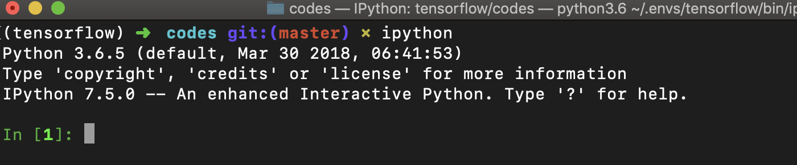

# 软件

# 工具

## iPython

执行指令如下：

```bash
ipython
```



# 网站

## 在线刷题

虽然刷题一直饱受诟病，不过不可否认刷题确实能锻炼我们的编程能力，相信每个认真刷题的人都会有体会。现在提供在线编程评测的平台有很多，比较有名的有 [hihocoder](http://hihocoder.com/)，[LintCode](http://www.lintcode.com/zh-cn/)，以及这里我们关注的 [LeetCode](https://leetcode.com/)。


